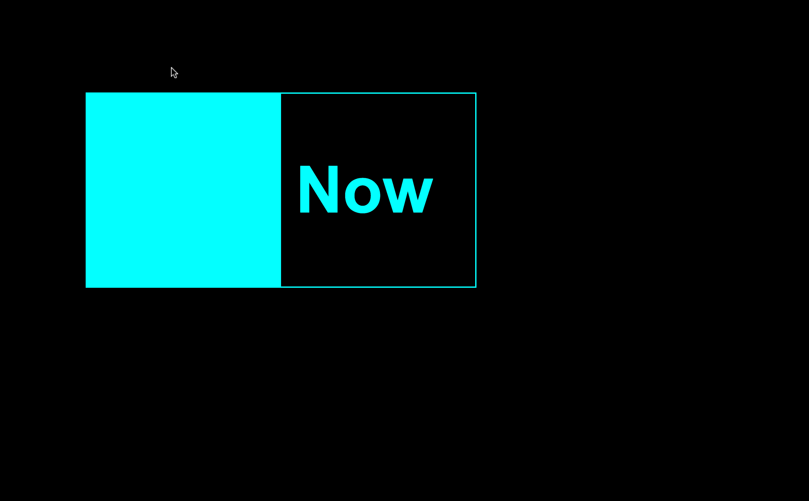

# Animated Button with Hover Effect

A sleek, animated button with a cyan border and smooth hover effect. Perfect for dark-themed websites, enhancing user experience with its modern design and new interactive features.

## Features

- **Modern Design**: Stylish button with a transparent background and cyan border.
- **Smooth Animation**: Hover effect fills the button with cyan color, transitioning text color to black.
- **Responsive**: Designed to be fully responsive, adaptable to various screen sizes.

## Installation

1. Clone the repository:
    ```bash
    git clone [https://github.com/kaakanksha2310/Button.git]
    ```
2. Navigate to the project directory:
    ```bash
    cd button-repository
    ```

## Usage

Include the `styles.css` file in your project and add the button element to your HTML file.

## Preview



## License

This project is licensed under the MIT License - see the [LICENSE](LICENSE) file for details.

## Contributing

Contributions are welcome! Please open an issue or submit a pull request.

## Contact

For any questions or suggestions, please reach out via the repository's issue tracker or contact the maintainers.
---

